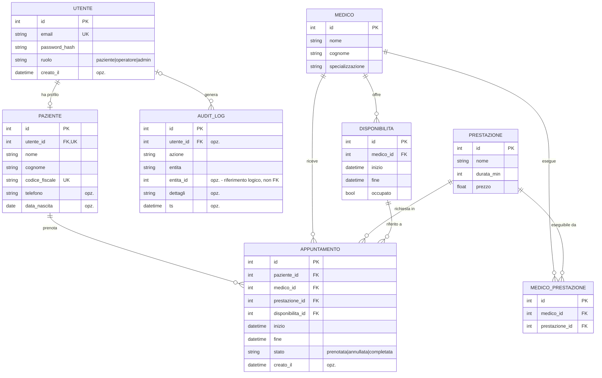

# Modello dati - Diagramma ER

Sistema gestionale Poliambulatorio. Le entità del dominio sono **Utente**,
**Paziente**, **Medico**, **Prestazione**, **MedicoPrestazione** (tabella di
associazione molti-a-molti), **Disponibilità**, **Appuntamento** e **AuditLog**.

Gli attributi contrassegnati con `opz.` ammettono valore nullo; tutti gli altri
sono `NOT NULL`.



Il campo `AUDIT_LOG.entita_id` non è una chiave esterna: identifica un record
della tabella indicata da `entita`, quindi il suo bersaglio varia da riga a riga
e non è vincolabile dallo schema. `AUDIT_LOG.utente_id` è opzionale perché il
log sopravvive alla cancellazione dell'utente (cfr. [`NOTE.md`](NOTE.md),
"Limiti noti").

## Vincoli

### Dichiarati nello schema

- `UTENTE.email`, `PAZIENTE.codice_fiscale` e `PAZIENTE.utente_id` sono unici.
- `MEDICO_PRESTAZIONE(medico_id, prestazione_id)` è unica
  (`uq_medico_prestazione`): la stessa coppia non può essere associata due volte.
- Chiavi esterne dichiarate su tutte le associazioni. SQLite però non le applica
  senza `PRAGMA foreign_keys=ON`, qui non impostato: sono quindi documentali
  (cfr. [`NOTE.md`](NOTE.md), "Limiti noti").

### Applicati dal livello di servizio

Non essendo esprimibili in modo dichiarativo, sono verificati dai servizi a ogni
operazione:

- Una prenotazione è valida solo se la coppia `(medico_id, prestazione_id)`
  esiste in `MEDICO_PRESTAZIONE`.
- Uno slot con `occupato = true` non può essere prenotato di nuovo.
- Le disponibilità di uno stesso medico non si sovrappongono (verificato dal
  generatore ricorrente).
- Uno slot può avere più righe in `APPUNTAMENTO` ma **al più una in stato non
  terminale**: annullamento e riprogrammazione liberano lo slot lasciando lo
  storico, che resta collegato. Per il ciclo di vita si veda
  [`stati-prenotazione.md`](stati-prenotazione.md).

## Scelte progettuali

- **Ridondanza in `APPUNTAMENTO`.** `medico_id`, `inizio` e `fine` sono
  derivabili da `DISPONIBILITA`, ma vengono duplicati di proposito: la
  prenotazione conserva così i dati concordati con il paziente anche se lo slot
  di origine viene in seguito modificato o rimosso.
- **Chiave surrogata su `MEDICO_PRESTAZIONE`.** In alternativa alla chiave
  composta `(medico_id, prestazione_id)`, si è preferito un `id` autonomo con
  vincolo di unicità sulla coppia, per uniformità con le altre tabelle e per
  poter indirizzare l'associazione con un solo identificativo.
- **Datetime naive in ora locale** su tutti i campi temporali, un unico orologio
  per l'intero database (cfr. [`NOTE.md`](NOTE.md)).

## DDL (estratto)

Lo schema è generato da SQLAlchemy; si riporta la sola tabella di associazione,
la più significativa dal punto di vista dei vincoli.

```sql
CREATE TABLE medico_prestazione (
    id             INTEGER PRIMARY KEY,
    medico_id      INTEGER NOT NULL REFERENCES medico(id),
    prestazione_id INTEGER NOT NULL REFERENCES prestazione(id),
    CONSTRAINT uq_medico_prestazione UNIQUE (medico_id, prestazione_id)
);

CREATE INDEX ix_medico_prestazione_medico_id      ON medico_prestazione (medico_id);
CREATE INDEX ix_medico_prestazione_prestazione_id ON medico_prestazione (prestazione_id);
```

Sono indicizzati inoltre `utente.email` e `disponibilita.medico_id`, colonne
usate rispettivamente dall'autenticazione e dalla ricerca degli slot.

## Creazione dello schema

Lo schema viene creato automaticamente all'avvio dell'applicazione tramite
`Base.metadata.create_all()` (in `app/main.py`) e popolato con i dati di esempio
dal modulo `app/db/seed.py`.