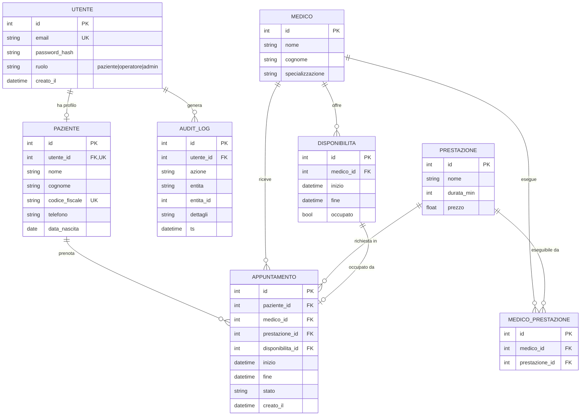

# Modello dati - Diagramma ER

Sistema gestionale Poliambulatorio (v2.0). Le entita nuove/aggiornate rispetto
alla v1 sono **Medico**, **Prestazione**, **MedicoPrestazione** (nuova tabella di
associazione molti-a-molti) e **Disponibilita**.



## Vincoli principali

- `MEDICO_PRESTAZIONE(medico_id, prestazione_id)` ha un vincolo di **unicita**
  (`uq_medico_prestazione`): la stessa coppia non puo' essere associata due volte.
- Un medico puo' eseguire **piu'** prestazioni; una prestazione puo' essere
  eseguita da **piu'** medici (molti-a-molti).
- Una prenotazione (`APPUNTAMENTO`) e' valida solo se la coppia
  `(medico_id, prestazione_id)` esiste in `MEDICO_PRESTAZIONE`.
- Uno slot `DISPONIBILITA` occupato non puo' essere prenotato di nuovo.

## DDL equivalente (SQLite)

```sql
CREATE TABLE medico_prestazione (
    id             INTEGER PRIMARY KEY,
    medico_id      INTEGER NOT NULL REFERENCES medico(id),
    prestazione_id INTEGER NOT NULL REFERENCES prestazione(id),
    CONSTRAINT uq_medico_prestazione UNIQUE (medico_id, prestazione_id)
);
```
