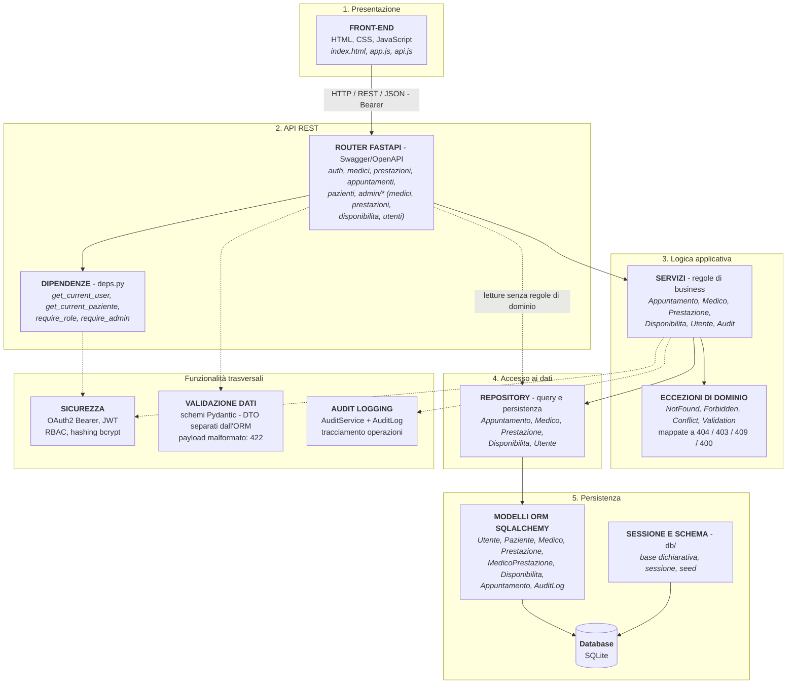

# Architettura logica

Organizzazione a livelli del sistema e responsabilità.

## Responsabilità dei livelli

| Livello | Responsabilità |
|---|---|
| **Presentazione** | Interfaccia utente, conservazione del token, resa di calendario e agenda |
| **API REST** | Instradamento, validazione del payload (`422` se malformato), autenticazione e controllo dei ruoli, traduzione delle eccezioni in codici HTTP |
| **Logica applicativa** | Regole di dominio (associazione medico-prestazione, stati della prenotazione, sovrapposizione degli slot), audit, hashing delle password |
| **Accesso ai dati** | Query e transazioni, isolamento di SQLAlchemy dal resto |
| **Persistenza** | Definizione delle entità e dello schema, sessione e popolamento iniziale |

## Principio guida

Il front-end non applica vincoli e il repository non valuta la liceità di un'operazione: ogni regola è verificata dal livello dei servizi.

La dipendenza è **unidirezionale**: nessun livello conosce quelli soprastanti.
Le eccezioni di dominio sono l'unico canale di ritorno dal livello applicativo
verso le API, e vengono tradotte in codici HTTP da un punto unico (`main.py`),
evitando che i router replichino la stessa logica di conversione.

Una sola deroga, deliberata: le **letture prive di regole di dominio**
(elenco medici, elenco prestazioni, slot liberi, elenco pazienti) sono servite
dal router direttamente tramite il repository, senza attraversare il livello
dei servizi. Introdurre un servizio che si limiti a inoltrare la chiamata
aggiungerebbe un livello senza contenuto; tutte le operazioni di scrittura e
tutte quelle soggette a regole passano invece dai servizi.