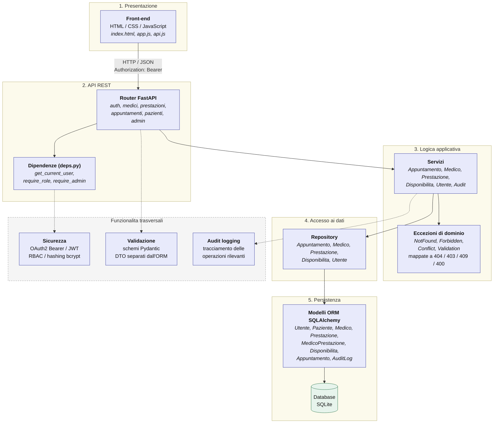

# Architettura logica

Organizzazione a livelli del sistema e responsabilita.

## Responsabilita dei livelli

| Livello | Responsabilita | Cosa non fa |
|---|---|---|
| **Presentazione** | Interfaccia utente, conservazione del token, resa di calendario e agenda | Nessuna regola di business: ogni vincolo e' verificato lato server |
| **API REST** | Instradamento, validazione del payload, autenticazione e controllo dei ruoli, traduzione delle eccezioni in codici HTTP | Non contiene regole applicative |
| **Logica applicativa** | Regole di dominio (associazione medico-prestazione, stati della prenotazione, sovrapposizione degli slot), audit | Non conosce HTTP ne' costruisce query |
| **Accesso ai dati** | Query e transazioni, isolamento di SQLAlchemy dal resto | Non decide se un'operazione sia lecita |
| **Persistenza** | Definizione delle entita e dello schema | - |

## Principio guida

La dipendenza e' **unidirezionale**: ogni livello conosce solo quello
immediatamente sottostante. Le eccezioni di dominio sono l'unico canale di
ritorno dal livello applicativo verso le API, e vengono tradotte in codici HTTP
da un punto unico (`main.py`), evitando che i router replichino la stessa
logica di conversione.
