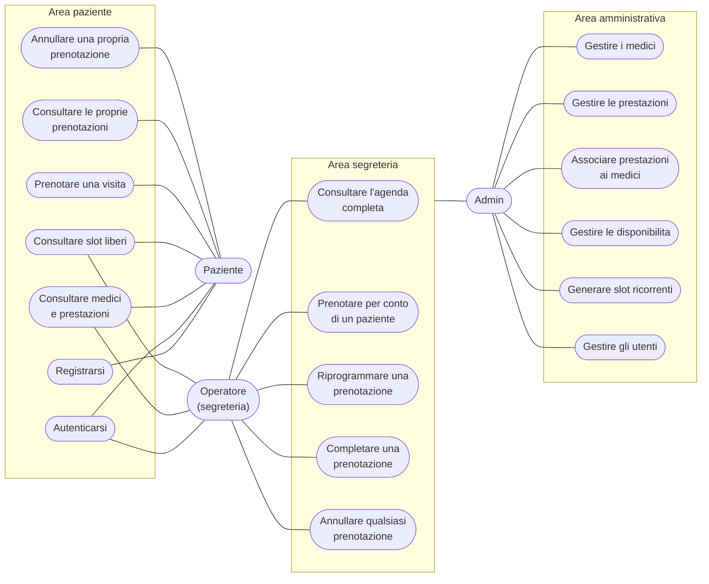

# Casi d'uso

Attori del sistema e funzionalita accessibili a ciascuno. I ruoli sono
cumulativi: l'**Operatore** dispone delle funzioni di segreteria, l'**Admin**
di quelle di segreteria piu' la configurazione del poliambulatorio.

## Note sui casi d'uso

- **Prenotare una visita** e **Consultare le proprie prenotazioni** sono
  riservati al ruolo `paziente`: un account di segreteria non ha un profilo
  paziente collegato e riceve `403`. La segreteria opera invece tramite
  *Prenotare per conto di un paziente*.
- **Prenotare una visita** include sempre la verifica che la prestazione scelta
  sia associata al medico dello slot: se l'associazione non esiste la richiesta
  viene respinta con `400`.
- **Riprogrammare**, **Completare** e **Annullare qualsiasi prenotazione** sono
  ammessi solo su prenotazioni attive (vedi
  [`stati-prenotazione.md`](stati-prenotazione.md)).
- **Generare slot ricorrenti** e' una specializzazione di *Gestire le
  disponibilita*: crea in blocco gli slot di un periodo saltando quelli che si
  sovrapporrebbero a slot gia esistenti.
