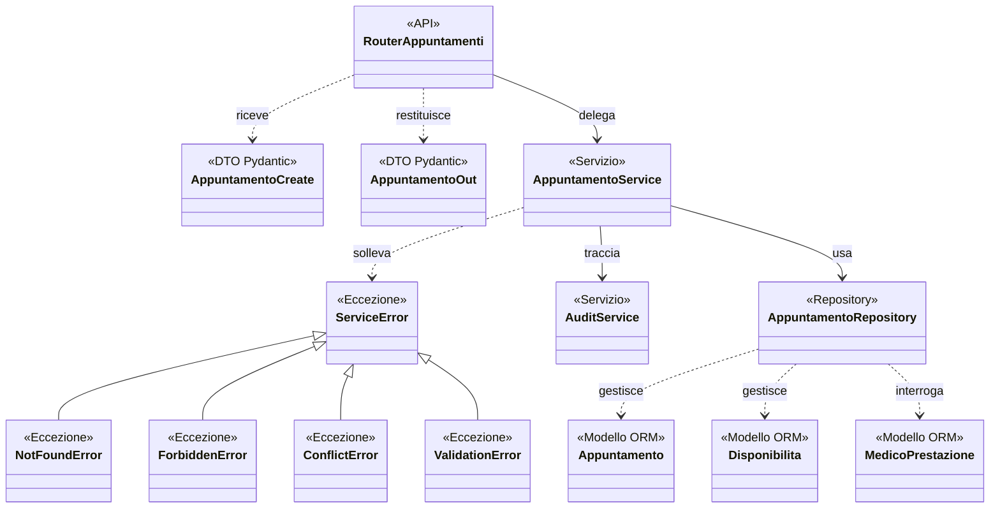

# Classi coinvolte nel flusso di prenotazione

Classi del caso d'uso «Prenota visita», dal router al database. 
Per la struttura delle tabelle si veda [`ER.md`](ER.md).

## Firme dei metodi

Gli attributi dei DTO sono in `backend/app/schemas/appuntamento.py`, quelli dei
modelli ORM in [`ER.md`](ER.md).

**`RouterAppuntamenti`** — `backend/app/api/v1/appuntamenti.py`

| Firma | Ruolo |
|---|---|
| `_service(db) -> AppuntamentoService` | Costruisce service e repository per la richiesta |
| `prenota(data, paziente, db) -> AppuntamentoOut` | Il paziente prenota per sé |
| `le_mie(paziente, db) -> List[AppuntamentoOut]` | Prenotazioni del paziente autenticato |
| `annulla(app_id, data, paziente, db) -> AppuntamentoOut` | Annullamento da parte del paziente |
| `agenda_completa(db, _) -> List[AppuntamentoDettaglioOut]` | Agenda di segreteria/admin |
| `prenota_per_paziente(data, db, operatore) -> AppuntamentoOut` | La segreteria prenota per conto di un paziente |
| `modifica_qualsiasi(app_id, data, db, operatore) -> AppuntamentoOut` | Riprogramma, annulla o completa |

**`AppuntamentoService`** — `backend/app/services/appuntamento_service.py`

Costruttore: `__init__(repo, audit)`.

| Firma | Ruolo |
|---|---|
| `_valida_slot_prestazione(disponibilita_id, prestazione_id)` | Controlli comuni; ritorna lo slot valido |
| `prenota(paziente_id, utente_id, disponibilita_id, prestazione_id)` | Crea la prenotazione |
| `prenota_per(operatore_utente_id, paziente_id, disponibilita_id, prestazione_id)` | Come sopra, con verifica del paziente indicato |
| `le_mie(paziente_id)` | Elenco per paziente |
| `tutti_dettaglio()` | Agenda arricchita con i nomi |
| `annulla(utente_id, paziente_id, app_id)` | Annulla verificando la proprietà |
| `annulla_qualsiasi(utente_id, app_id)` | Annulla senza vincolo di proprietà |
| `completa(utente_id, app_id)` | Porta la prenotazione a `completata` |
| `riprogramma(utente_id, app_id, nuovo_slot_id)` | Sposta su altro slot dello stesso medico |

**`AppuntamentoRepository`** — `backend/app/repositories/appuntamento_repository.py`

Costruttore: `__init__(db: Session)`.

| Firma | Ruolo |
|---|---|
| `slot(disponibilita_id) -> Disponibilita` | Slot per identificativo |
| `slot_liberi(medico_id) -> List[Disponibilita]` | Slot non occupati e futuri |
| `prestazione(prestazione_id) -> Prestazione` | Prestazione per identificativo |
| `paziente(paziente_id) -> Paziente` | Paziente per identificativo |
| `medico_esegue(medico_id, prestazione_id) -> bool` | Verifica l'associazione medico-prestazione |
| `crea(paziente_id, slot, prestazione_id) -> Appuntamento` | Inserisce e occupa lo slot nella stessa transazione |
| `get(app_id) -> Appuntamento` | Appuntamento per identificativo |
| `list_by_paziente(paziente_id) -> List[Appuntamento]` | Prenotazioni di un paziente |
| `list_tutti_dettaglio() -> List[tuple]` | Join con paziente, medico e prestazione |
| `annulla(app) -> Appuntamento` | Stato `annullata` e slot liberato |
| `imposta_stato(app, stato) -> Appuntamento` | Cambio di stato semplice |
| `riprogramma(app, nuovo_slot) -> Appuntamento` | Libera il vecchio slot, occupa il nuovo |

**`AuditService`** — `backend/app/services/audit_service.py`:
`log(utente_id, azione, entita, entita_id=None, dettagli=None)`.

## Note

- Il router riceve e restituisce DTO Pydantic (`AppuntamentoCreate`, `AppuntamentoOut`); le entità SQLAlchemy non escono mai dal livello di accesso ai dati.
- Il service invoca i metodi del repository ricevuto nel costruttore, quindi nei test è sostituibile con un doppio.
- `_valida_slot_prestazione` è condiviso da
  `prenota` e `prenota_per`, con regole identiche per paziente e segreteria.
- `main.py` registra la traduzione in codici HTTP una volta sola essendoci una radice comune per tutte le eccezioni.