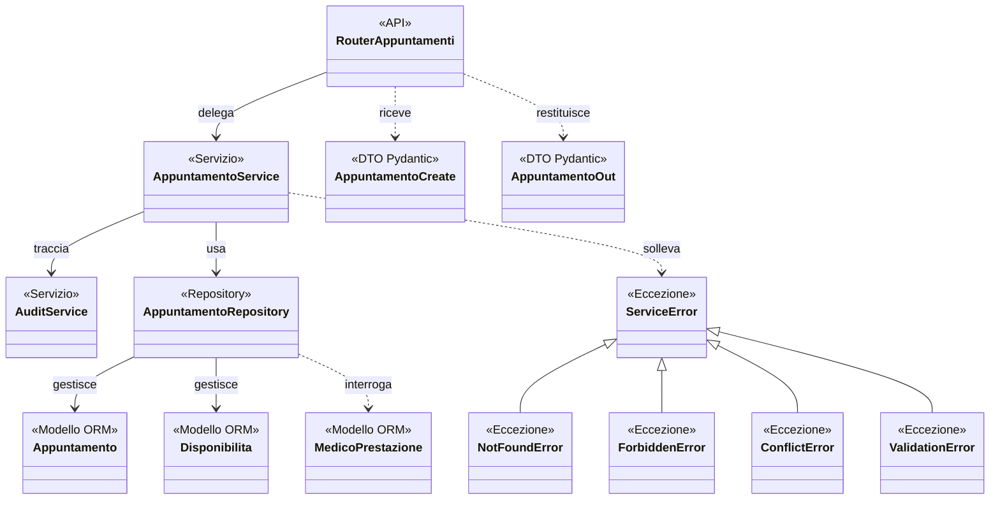

# Struttura a livelli - fetta verticale della prenotazione

Classi coinvolte nel caso d'uso "Prenota visita", dal router al database.
Mostra come il pattern architetturale si concretizza su una singola
funzionalita; per la struttura delle tabelle si veda [`ER.md`](ER.md).

## Elementi da osservare

- **Il router non conosce i modelli ORM**: riceve e restituisce DTO Pydantic
  (`AppuntamentoCreate`, `AppuntamentoOut`), mentre le entita SQLAlchemy non
  escono mai dal livello di accesso ai dati.
- **Il service non conosce SQLAlchemy**: riceve un repository nel costruttore e
  ne invoca i metodi, senza costruire query. Questo consente di sostituire il
  repository con un doppio nei test unitari.
- **Un solo punto di validazione**: `_valida_slot_prestazione` e' condiviso da
  `prenota` e `prenota_per`, cosi' le regole valgono identiche sia che prenoti
  il paziente sia che prenoti la segreteria.
- **Le eccezioni derivano da una radice comune**, il che permette a `main.py` di
  registrare la traduzione in codici HTTP una volta sola.
