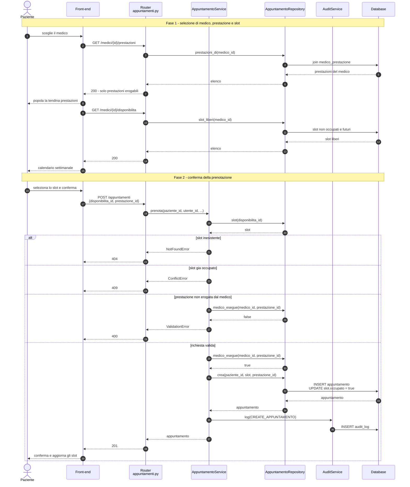

# Flusso "Prenota visita" - diagramma di sequenza

Il caso d'uso principale attraverso i livelli dell'architettura.

## Note sul flusso

- Il **router non contiene regole applicative**: invoca il service e restituisce
  la risposta; le eccezioni di dominio diventano codici HTTP tramite gli
  exception handler registrati in `main.py`.
- I rami di errore sono i controlli di
  `AppuntamentoService._valida_slot_prestazione`, condivisi con la prenotazione
  della segreteria (`POST /appuntamenti/operatore`). La verifica `medico_esegue`
  interroga la tabella `medico_prestazione`: è la regola che impedisce di
  prenotare una prestazione presso un medico che non la eroga.
- `crea` inserisce l'appuntamento e occupa lo slot nella stessa transazione,
  così nessuno slot risulta prenotato senza appuntamento corrispondente.
