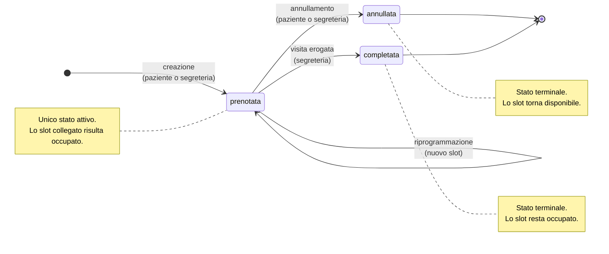

# Ciclo di vita della prenotazione

Stati ammessi per un `Appuntamento` e transizioni consentite.

## Regole applicate

| Operazione | Stato di partenza richiesto | Esito se lo stato e' diverso |
|---|---|---|
| Annullare (paziente o segreteria) | `prenotata` | `409` |
| Completare | `prenotata` | `409` se `annullata` |
| Riprogrammare | `prenotata` | `409` |

`annullata` e `completata` sono **stati terminali**: da essi non parte alcuna
transizione. Il vincolo non e' formale ma sostanziale, perche' solo una
prenotazione attiva "possiede" il proprio slot. Agire su una prenotazione gia
terminata libererebbe uno slot che nel frattempo puo' essere stato assegnato a
un'altra prenotazione, producendo due appuntamenti sullo stesso orario.

Copertura di test: `backend/tests/test_stati_prenotazione.py`.
