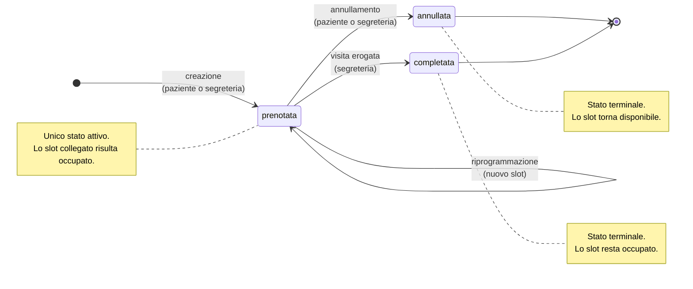

# Ciclo di vita della prenotazione

Stati ammessi per un `Appuntamento` e transizioni consentite.

## Regole applicate

Annullamento, completamento e riprogrammazione richiedono lo stato `prenotata`:
da uno stato terminale il service risponde `409`. Il vincolo non è formale ma
sostanziale, perché solo una prenotazione attiva "possiede" il proprio slot.
Agire su una prenotazione già terminata libererebbe uno slot che nel frattempo
può essere stato assegnato a un'altra, producendo due appuntamenti sullo stesso
orario.

Copertura di test: `backend/tests/test_stati_prenotazione.py`.
